  

## Hi, I'm Hafizul 👋

I'm a **Mechatronics Engineering graduate** from Selangor, Malaysia, looking for a **graduate / junior Software Engineer** role.

Mechatronics gave me a bit of everything: programming, electronics and systems thinking. What I enjoy most is writing software. I like building small, useful tools, and I learn best by building projects and figuring things out along the way.

## Projects

**[Monthly Commitment Calculator](https://github.com/PijoyXryo/monthly-commitment-calculator)** · Python 
A desktop app for tracking monthly bills and commitments against income, with CSV and PDF export.

**[STM32 Bare-Metal Drivers](https://github.com/PijoyXryo/stm32-bare-metal)** · C · *work in progress* 
Learning how microcontrollers work under the hood by writing drivers from the datasheet, tested in a simulator.

**[Clinic App](https://github.com/PijoyXryo/cllinic-app)** · JavaScript / Node.js 
A small practice project: a clinic report with fee rules and follow-up dates.

## Skills

**Languages:** Python · JavaScript · C · TypeScript (basic) 
**Tools:** Git & GitHub · VS Code · Linux · React (basic)

## Currently learning

Building more complete projects and improving how I write clean, tested code.
