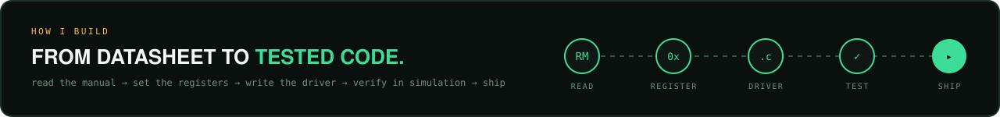

  

  <b>Embedded &amp; Firmware Engineer · Selangor, Malaysia</b> 
  Writing C that talks straight to the hardware, plus the software around it.

  
  
  

  <a href="https://github.com/PijoyXryo?tab=repositories">All repositories</a>

  

I'm **Hafizul**, an embedded and firmware engineer. I like the part of engineering where you open a 1,700-page reference manual, find the right register and make the hardware do exactly what you want, with **no HAL and no magic**. I also build desktop and web tools in Python and JavaScript, because good firmware still needs good software around it.

My **STM32 bare-metal driver project** is the main one. It's built from the startup code up and verified in the Renode simulator, so anyone can run it without a board.

## Selected work

| | Project | What it shows | Stack |
|:-:|---|---|---|
| **01** | [**stm32-bare-metal**](https://github.com/PijoyXryo/stm32-bare-metal) | Startup code, vector table, linker script and a UART driver written from the reference manual. Runs in Renode. Interrupt-driven RX, GPIO/SysTick and CI are in progress. | C · ARM Cortex-M4 · Make · Renode |
| **02** | [**monthly-commitment-calculator**](https://github.com/PijoyXryo/monthly-commitment-calculator) | Modular desktop app with a custom calendar widget, income-load meter, dark/light theme, and CSV + PDF report export. | Python · customtkinter · ReportLab |
| **03** | [**clinic-app**](https://github.com/PijoyXryo/cllinic-app) | Node.js clinic report showing age-based fee rules and follow-up date scheduling. | JavaScript · Node.js · Day.js |

## Toolbox

  
  
  
  
  
  
  
  
  
  
  

## Currently working on

- Interrupt-driven UART RX with a unit-tested ring buffer
- GPIO and SysTick drivers
- Automated Renode tests running in GitHub Actions
